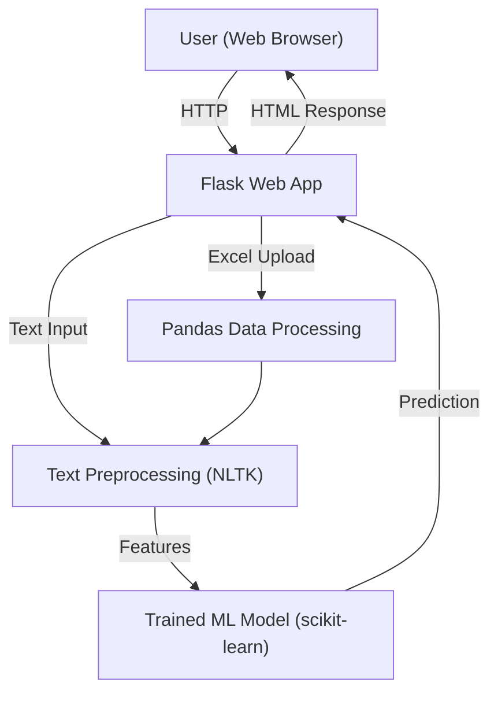
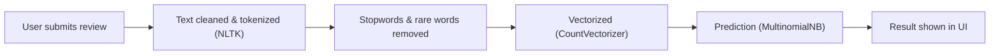

# SentimentPro: Sentiment Analysis Web App

SentimentPro is a modern Flask web application for analyzing the sentiment of user reviews. Upload text or Excel/CSV files, and visualize sentiment breakdowns with beautiful interactive charts.

## Features
- **Instant Sentiment Prediction:** Enter a review and get real-time sentiment analysis (Good, Bad, Neutral).
- **Bulk Analysis via Excel/CSV Upload:** Upload files and see a breakdown of review sentiments.
- **Interactive Charts:** Visualize sentiment distribution with clear, modern charts.
- **Clean, Responsive UI:** Built with Bootstrap and custom styles for a seamless experience.

## Architecture

SentimentPro is a modular Flask web app with a clear separation between the web interface, preprocessing, and machine learning model. It uses NLTK for text processing and scikit-learn for sentiment prediction.

## About the Model & Training Data

- **Model Type:** Multinomial Naive Bayes classifier (scikit-learn)
- **Training Data:** Drugs.com Drug Review Dataset, combining both train and test splits. 
    - [UCI Machine Learning Repository](https://archive.ics.uci.edu/ml/datasets/Drug+Review+Dataset+%28Drugs.com%29)
    - [Kaggle Dataset](https://www.kaggle.com/datasets/jessicali9530/kuc-hackathon-winter-2018?resource=download)
- **Data Size:** ~215,000+ user reviews of medications.
- **Labeling:**
    - Reviews are labeled as:
        - `positive` if the rating is 8 or above
        - `negative` if the rating is 4 or below
        - `neutral` otherwise
- **Text Processing:**
    - Reviews are cleaned, tokenized, lowercased, and filtered for stopwords/punctuation using NLTK.
    - Features are extracted using CountVectorizer.
- **Prediction:**
    - The model predicts whether a review is positive, negative, or neutral based on the text content.

### Why Drugs.com Data?
- It is a real-world, large-scale dataset of user experiences with medications, making it ideal for demonstrating general sentiment analysis workflows.

### Note
- The model is generic and can be retrained on your own labeled review data for other domains (e.g., product reviews, movie reviews, etc.)

### High-Level Architecture


### Review Prediction Flow


## Getting Started

### Prerequisites
- Python 3.8+
- pip
- (Recommended) Create and activate a virtual environment

### Installation
```bash
pip install -r requirements.txt
```

### Running Locally
```bash
# Activate your virtual environment if needed
export FLASK_APP=app.py
flask run
```
Visit [http://127.0.0.1:5000](http://127.0.0.1:5000) in your browser.

## Deployment on Render

You can deploy SentimentPro to [Render](https://render.com/) as a free or paid web service.

1. **Ensure these files are present in your repo root:**
   - `app.py`, `requirements.txt`, `Procfile`, `render.yaml`, `Model.pickle`, `cv1`, `text_utils.py`, and the `templates/` and `static/` folders.
2. **Push your code to GitHub.**
3. **Create a new Web Service on Render:**
   - Connect your GitHub repo
   - Render will auto-detect `render.yaml` and build your app
   - The service will use `gunicorn app:app` to start (see `Procfile`/`render.yaml`)
4. **Access your app at the Render-provided URL.**

**Note:** `Model.pickle` and `cv1` must be present in the root directory for the app to work.

### Production Deployment (other platforms)
- Use a WSGI server like Gunicorn (see `Procfile` for Heroku/Render)
- Ensure `Model.pickle` and `cv1` are present in the root directory

## Folder Structure
```
├── app.py                # Main Flask application
├── text_utils.py          # Text processing utilities
├── requirements.txt      # Python dependencies
├── Procfile              # For deployment (Heroku/Render)
├── Model.pickle          # Trained ML model (required for prod)
├── cv1                   # Trained vectorizer (required for prod)
├── static/
│   ├── icon.png          # App icon
│   ├── style.css         # Custom styles
│   └── ...               # Other images/assets
├── templates/
│   ├── home.html         # Main page
│   ├── pie_chart.html    # Excel chart page
│   ├── result.html       # Prediction result page
│   └── about.html        # About page
```

## Credits
- Developed by Atul Kumar and contributors.
- Built with Flask, scikit-learn, pandas, Chart.js, Bootstrap.

---
For questions or contributions, open an issue or pull request.
